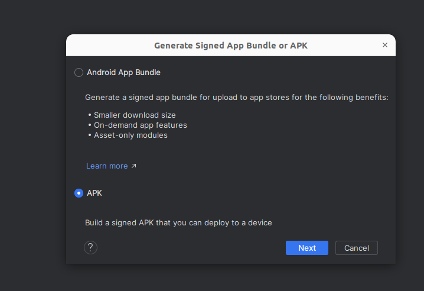
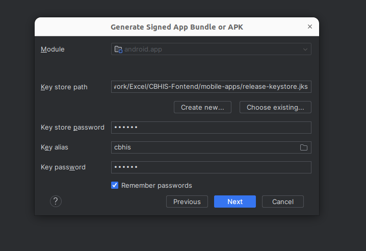
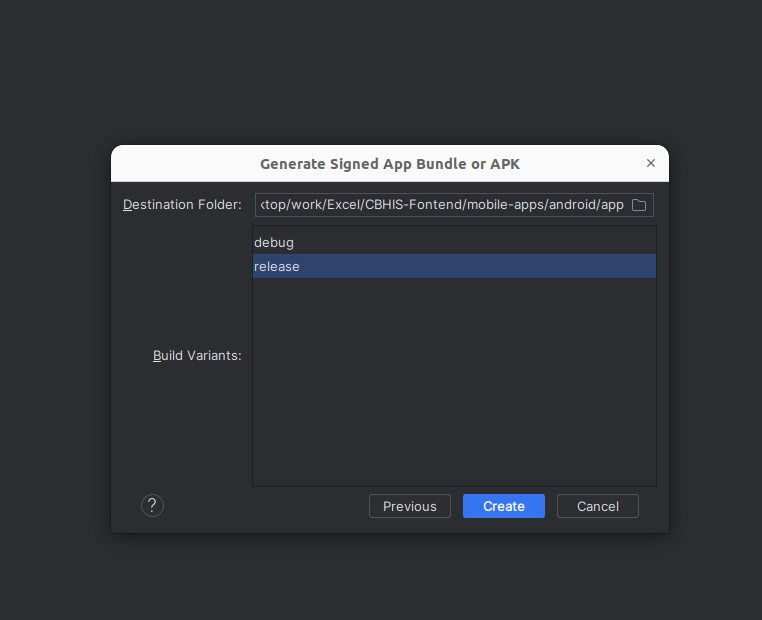

# CBHIS (Community Based Health Information System) Setup and Build Guide

## Table of Contents

1. [Introduction](#introduction)
2. [Prerequisites](#prerequisites)
3. [Setup Environment](#setup-environment)
    - [Node.js](#nodejs)
    - [Android Studio](#android-studio)
    - [Ionic CLI](#ionic-cli)
    - [Angular](#angular)
4. [Clone the Repository](#clone-the-repository)
5. [Setup the Project](#setup-the-project)
6. [Running the Project Locally](#running-the-project-locally)
7. [Change the Production URL in Environment file](#change-the-production-url-in-environment-file)
8. [Building the APK using Android Studio](#building-the-apk-using-android-studio)
    - [Credentials for build the APK](#credentials-for-build-the-apk)
9. [Troubleshooting](#troubleshooting)
10. [Contact](#contact)

## Introduction

CBHIS (Community Based Health Information System) is a mobile application created for Rural Health Motivators (RHMs) to collect health-related information in a survey format. The app works offline after initial setup and first login, with data syncing capabilities when online.

## Prerequisites

Before you begin, ensure you have the following installed:

-   Git
-   Node.js
-   Android Studio
-   Ionic CLI

## Setup Environment

### Node.js

1. Download and install Node.js from the [official website](https://nodejs.org/). Follow the instructions for your operating system.
2. Verify the installation by running:
    ```
    node -v
    npm -v
    ```

### Android Studio

1. Download and install Android Studio from the [official website](https://developer.android.com/studio).
2. Follow the installation instructions and set up the Android SDK.
3. Make sure to install the required SDK tools and packages.

### Ionic CLI

1. Install Ionic CLI globally using npm:
    ```
    npm install -g @ionic/cli
    ```

### Angular

1. Angular comes pre-installed with Ionic. Verify by running:
    ```
    ng version
    ```

## Clone the Repository

1. Open a terminal or command prompt.
2. Clone the repository using Git:
    ```
    git clone https://github.com/Excel-Technologies-Ltd/CBHIS-Fontend.git
    ```
3. Navigate into the project directory:
    ```
    cd CBHIS-Fontend/mobile-apps
    ```

## Setup the Project

1. Install project dependencies:
    ```
    npm install
    ```

## Running the Project Locally

1. Start the Ionic development server:
    ```
    ionic serve
    ```
2. Open a browser and go to [http://localhost:8100](http://localhost:8100) to see the running application.

## Change the Production URL in Environment file

1. Open the `src/environments/environment.prod.ts` file in your project.
2. Locate the `baseUrl` property and update it with the desired production URL.
3. Save the file.

## Building the APK using Android Studio

1. Ensure the project is synchronized with Capacitor and open it in Android Studio:
    ```
    npm run open
    ```
2. In menubar of Android Studio click on `Build` and then `Generate Signed App Bundle / APK`.

3. Select `APK` and click `Next`.

    

4. Select the `Key store path` and `Key store password` and click `Next`.

    

5. Select the `Key Alias` and `Key Password` and click `Next`.

6. Select the `Destination folder` and `Build Variants` as `release`, then click `Create`.

    

### Credentials for build the APK

1. Key store path: `mobile-apps/release-keystore.jks`
2. Key store password: `123456`
3. Key Alias: `cbhis`
4. Key Password: `123456`

## Troubleshooting

-   Ensure all dependencies are properly installed.
-   Check console output for any errors and address them as needed.
-   If you encounter any issues, please refer to the [Ionic Documentation](https://ionicframework.com/docs) or contact the developers.
